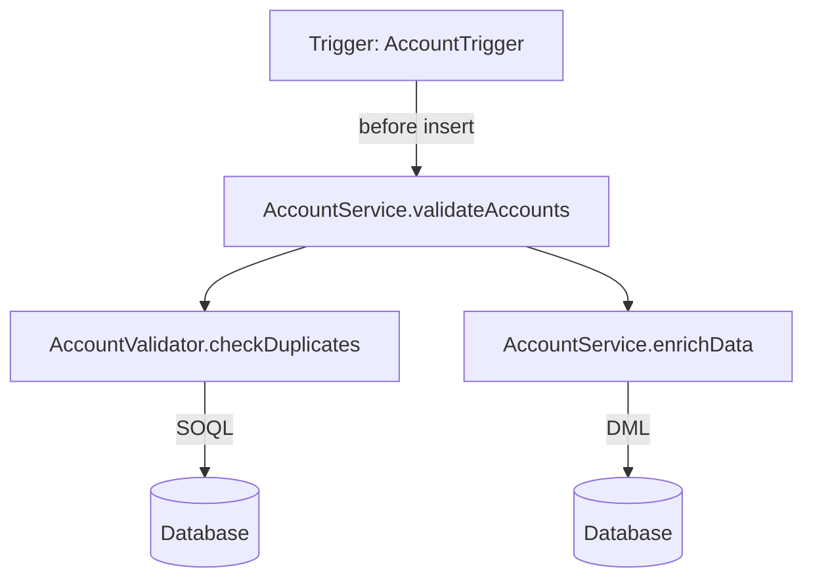

# Salesforce Org Analyzer

A comprehensive tool for analyzing and documenting Salesforce org metadata, execution paths, and automations using AI-powered analysis. Features enhanced Apex parsing capabilities and detailed execution path tracking.

## System Requirements
- macOS 12.0 or later
- Python 3.8 or later
- At least 16GB RAM
- 20GB free disk space (for Python packages and ML models)
- Internet connection for initial setup

## Enhanced Features

### Advanced Apex Parsing
- Complete class structure analysis including properties and inner classes
- Annotation parsing with parameter support
- Detailed method analysis including:
  - DML operations tracking
  - SOQL query parsing
  - Method call hierarchies
  - Documentation comment extraction
- Sharing rules detection
- Collection type support (List, Set, Map, Arrays)

### Code Analysis
- Execution path tracking across all automation types
- Recursion detection
- Entry point mapping
- Cross-object dependency tracking

## Project Structure
```
salesforce-analyzer/
├── src/
│   ├── apex/
│   │   ├── __init__.py
│   │   ├── parser.py          # Enhanced Apex parsing logic
│   │   └── analyzer.py        # Apex code analysis
│   ├── models/
│   │   ├── __init__.py
│   │   ├── apex_models.py     # Data models for Apex components
│   │   └── analysis_models.py # Analysis result models
│   ├── automations/
│   │   ├── __init__.py
│   │   ├── process_builder.py # Process Builder analysis
│   │   ├── flow.py           # Flow analysis
│   │   └── workflow.py        # Workflow rule analysis
│   ├── execution/
│   │   ├── __init__.py
│   │   ├── path_analyzer.py   # Execution path tracking
│   │   └── visualizer.py      # Mermaid diagram generation
│   ├── llm/
│   │   ├── __init__.py
│   │   └── documenter.py      # AI documentation generation
│   └── utils/
│       ├── __init__.py
│       └── sfdx_helper.py     # SFDX project utilities
├── tests/                     # Test files for each module
├── config/
│   └── default_config.yaml    # Configuration settings
├── pyproject.toml            # Poetry configuration
├── poetry.lock              # Poetry lock file
└── README.md                # This documentation
```

## Setup Instructions

### 1. Environment Setup

First, ensure you have Python 3.8+ installed:
```bash
python3 --version
```

Install Poetry (dependency management):
```bash
curl -sSL https://install.python-poetry.org | python3 -
```

### 2. Project Installation

Clone the repository:
```bash
git clone https://github.com/your-org/salesforce-analyzer.git
cd salesforce-analyzer
```

Install dependencies using Poetry:
```bash
poetry install
```

### 3. Configuration

Create a configuration file at `config/default_config.yaml`:
```yaml
analysis:
  parser:
    include_inner_classes: true
    parse_annotations: true
    track_dml: true
    track_soql: true
    parse_doc_comments: true
  
  execution:
    max_depth: 10
    include_workflow: true
    include_process_builder: true
    include_flows: true
    
  visualization:
    diagram_type: mermaid
    include_conditions: true
    show_dml_operations: true
    show_soql_queries: true
```

## Usage

### Basic Analysis

1. Extract Salesforce metadata:
```bash
sfdx force:source:retrieve -x path/to/package.xml -r ./force-app
```

2. Run the analyzer:
```bash
poetry run python -m salesforce_analyzer analyze \
    --source-path ./force-app \
    --output-dir ./analysis
```

### Advanced Usage

Analyze specific components with detailed options:
```bash
poetry run python -m salesforce_analyzer analyze \
    --source-path ./force-app \
    --objects Account,Contact \
    --include-dml \
    --include-soql \
    --track-sharing \
    --output-dir ./analysis
```

Generate execution path visualization:
```bash
poetry run python -m salesforce_analyzer visualize \
    --source-path ./force-app \
    --object Account \
    --trigger-context "before insert" \
    --show-dml \
    --show-conditions \
    --output-dir ./diagrams
```

### Example Output

The analyzer generates several types of documentation:

1. Class Analysis
```json
{
  "className": "AccountService",
  "methods": [
    {
      "name": "updateAccounts",
      "dmlOperations": [
        {
          "operation": "update",
          "object": "Account",
          "isBulk": true,
          "lineNumber": 45
        }
      ],
      "soqlQueries": [
        {
          "query": "SELECT Id, Name FROM Account",
          "referencedObjects": ["Account"],
          "lineNumber": 42
        }
      ]
    }
  ]
}
```

2. Execution Path Diagram (Mermaid)


## Contributing

1. Fork the repository
2. Create a feature branch
3. Install development dependencies:
```bash
poetry install --with dev
```

4. Run tests:
```bash
poetry run pytest
```

5. Submit a pull request

## Troubleshooting

### Common Issues

1. Memory Issues
```bash
export PYTHON_MEMORY_LIMIT=8G
```

2. Parser Errors
Check the log file at `logs/parser.log` for detailed error messages.

3. Missing Dependencies
```bash
poetry install --no-dev
```

## License

MIT License - see LICENSE file for details
